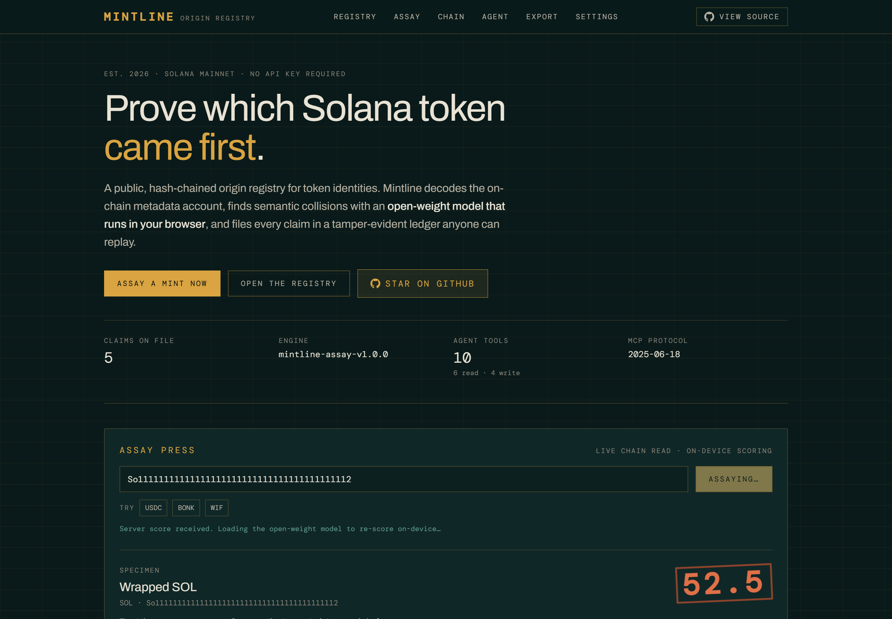
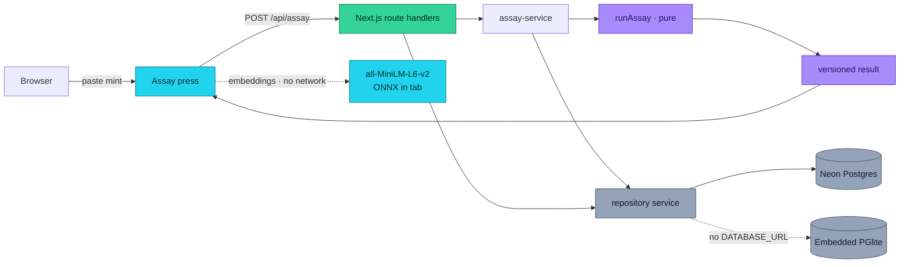
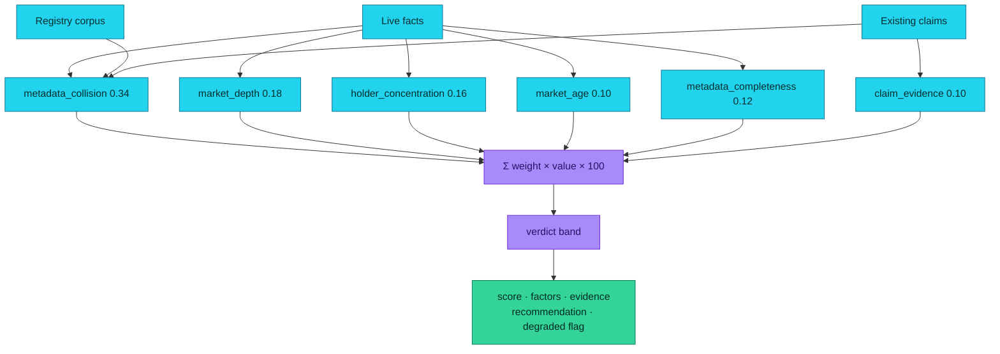
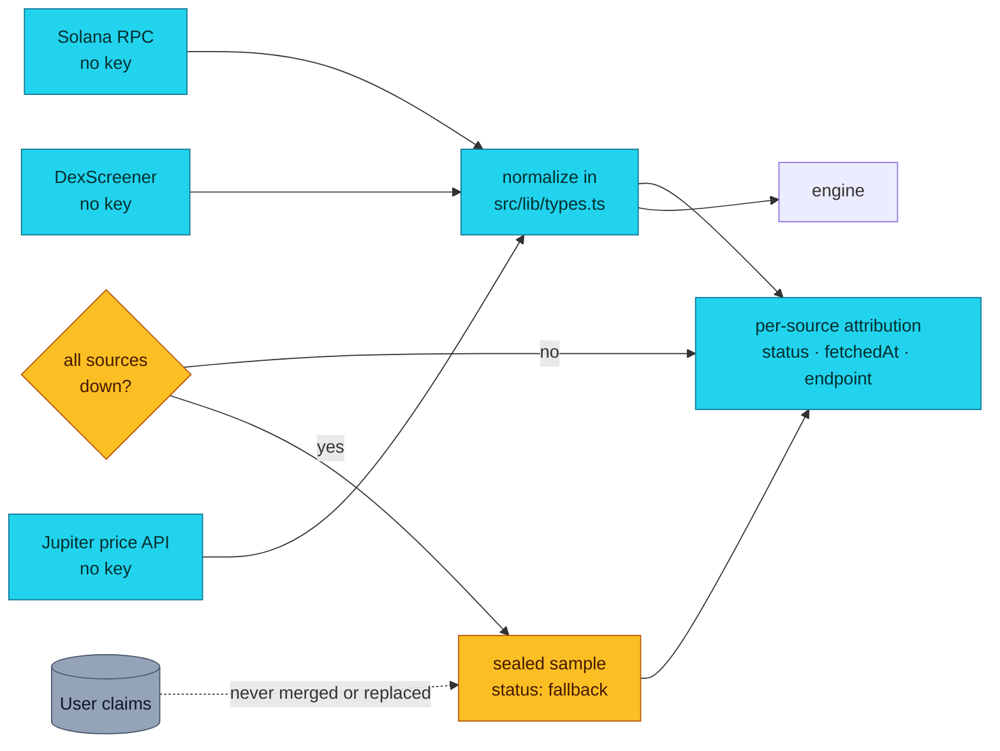
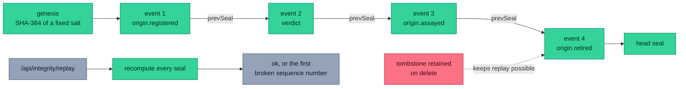
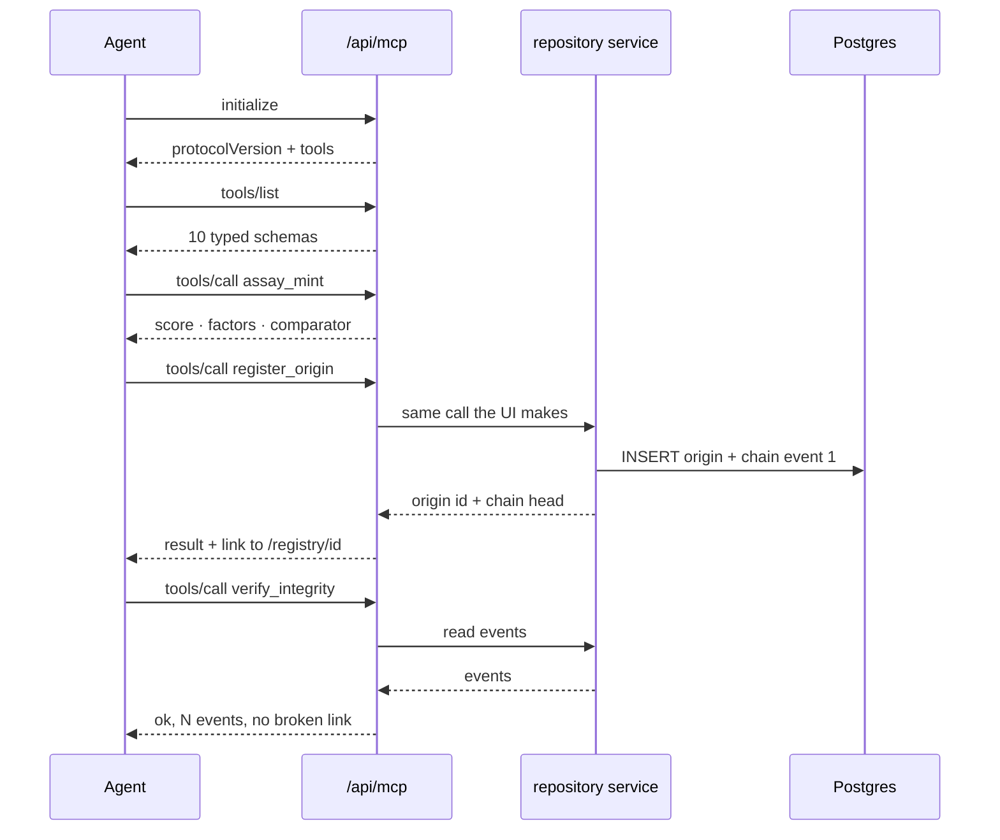
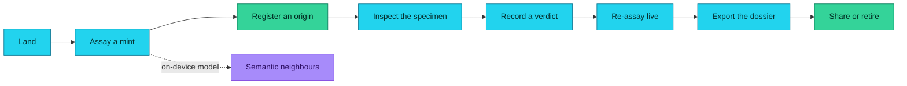
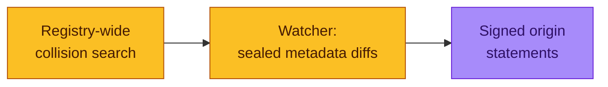
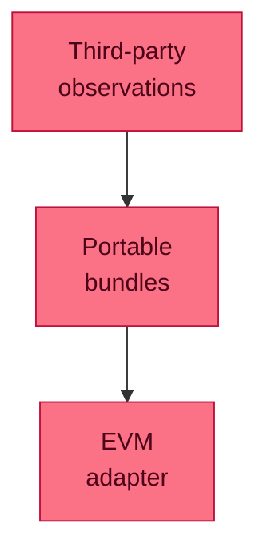

<div align="center">

# Mintline

### Prove which Solana token came first.

**A public, hash-chained origin registry for Solana token identities.** It decodes
on-chain metadata, finds semantic collisions with an open-weight model that runs
**in your browser**, and files every claim in a tamper-evident ledger anyone can
replay.

[](https://mintline-eight.vercel.app)
[](tsconfig.json)
[](https://nextjs.org)
[](LICENSE)
[](#-data-provenance)
[](https://huggingface.co/Xenova/all-MiniLM-L6-v2)
[](https://mintline-eight.vercel.app/agent)
[](#-integrity)
[](https://github.com/aniruddhaadak80/mintline/actions)

[**Live app**](https://mintline-eight.vercel.app) · [**Source**](https://github.com/aniruddhaadak80/mintline) · [**API**](https://mintline-eight.vercel.app/api/health) · [**Agent**](https://mintline-eight.vercel.app/agent) · [**Issues**](https://github.com/aniruddhaadak80/mintline/issues)



<sub>Real output. Wrapped SOL assayed against live Solana data, scored 52.5. The stamp ink is driven by the score.</sub>

</div>

---

## The problem

Solana launchpads mint thousands of tokens a day. Copying an established
project's name and ticker is trivial, costs nothing, and is hard to spot — the
copy looks like a brand-new asset until someone loses money.

Today the answer is "ask in the group chat". That does not scale, does not
produce evidence, and nobody can check it later.

Mintline turns that into a registry: on-chain identity is decoded, compared
against everything already claimed, scored with a published formula, and sealed
into a chain that a third party can replay without trusting this app.

## ✨ Features

- **Decodes the chain itself.** Derives the Metaplex metadata account for a mint
  with hand-rolled ed25519 curve maths and borsh decoding — no indexer key, no
  wallet, no SDK. [Source](src/lib/solana/address.ts)
- **Runs the model on your machine.** A 22M-parameter sentence-embedding model
  loads in the browser via ONNX Runtime Web. The token's identity text never
  leaves the device, and it keeps working with no network after the first load.
  [Source](src/lib/engine/embed.ts)
- **Always has a deterministic floor.** The server compares with a lexical
  n-gram comparator that needs no model and no network, so a score is always
  reproducible. Whichever comparator ran is named in the response, the UI and
  every dossier.
- **Publishes its arithmetic.** Six weighted factors, itemised, each with the raw
  measured value it was computed from. Weights are in the API response and in
  the export.
- **Refuses to fake certainty.** A factor that could not be read contributes
  zero and flags the result `degraded`. Weights are never rebalanced around a
  gap, so a partial computation cannot look like a confident one.
- **Seals every action.** Create, verdict, re-assay, share and retire each
  append to a per-record SHA-384 chain. Replay recomputes every seal and names
  the first broken link. [Source](src/lib/integrity/chain.ts)
- **Scriptable by agents.** Ten typed MCP tools over JSON-RPC 2.0. The three
  mutating tools call the same service layer the UI calls, and they are
  idempotent on a supplied key. [Console](https://mintline-eight.vercel.app/agent)
- **Leaves you with a dossier.** Download the score, the factor table, the
  per-source attribution with fetch timestamps, the full seal list and the
  disclaimer as Markdown or JSON.

## 🚀 Quickstart

```bash
git clone https://github.com/aniruddhaadak80/mintline.git
cd mintline
npm install
npm run dev
```

Open <http://localhost:3000>. **Zero environment variables are required** — with
no `DATABASE_URL` the app runs on an embedded PGlite database in
`.mintline-data/`, and the full loop (CRUD, engine, MCP, replay, export) works.

Verify it end to end, against a real production build:

```bash
npm run build
node scripts/smoke.mjs        # boots its own server, walks the whole journey
```

### Production environment variables

| Variable | Required | Purpose |
| --- | --- | --- |
| `DATABASE_URL` | **yes in production** | Neon Postgres connection string, reached through the Neon HTTP driver. `/api/health` returns 503 if an ephemeral serverless runtime has none. Omit it and a long-lived Node server runs on the embedded adapter, which `/api/health` reports as `embeddedAdapter: true`. |
| `SESSION_SECRET` | recommended | Signs the anonymous session cookie. Without it a random per-process key is generated, so sessions do not survive a redeploy. |
| `NEXT_PUBLIC_SITE_URL` | recommended | Canonical origin for metadata, OpenGraph, sitemap and share links. |

See [`.env.example`](.env.example). Values are never committed.

## 🔌 API

Every endpoint is JSON, every error uses the same envelope, and every response
is scoped to the caller's anonymous session.

```bash
# Is the app healthy, and which store actually answered?
curl -s https://mintline-eight.vercel.app/api/health | jq

# Live, normalised chain facts for a mint, with attribution.
curl -s "https://mintline-eight.vercel.app/api/mint?mint=EPjFWdd5AufqSSqeM2qN1xzybapC8G4wEGGkZwyTDt1v" \
  | jq '{name: .metadata.name, liquidity: .liquidityUsd, holders: .holders.state,
        sources: [.sources[] | {id, status, fetchedAt}]}'

# Run the engine without persisting anything.
curl -s -X POST https://mintline-eight.vercel.app/api/assay \
  -H 'content-type: application/json' \
  -d '{"mint":"So11111111111111111111111111111111111111112"}' \
  | jq '{score: .result.score, verdict: .result.verdict, degraded: .result.degraded,
        factors: [.result.factors[] | {key, weight, value, points}]}'
```

A mutation, then a read-back, then the decision and the chain:

```bash
# 1. Create. The assay is computed server-side from live chain data,
#    so a stored record can never carry a score you supplied.
curl -s -c jar -X POST https://mintline-eight.vercel.app/api/origins \
  -H 'content-type: application/json' \
  -d '{"mint":"EPjFWdd5AufqSSqeM2qN1xzybapC8G4wEGGkZwyTDt1v","name":"Example claim","idempotencyKey":"demo-1"}' \
  | jq '{id: .origin.id, score, verdict, head: .origin.chainHead}'

ID=o_...   # take .origin.id from the response

# 2. Read it back.
curl -s -b jar "https://mintline-eight.vercel.app/api/origins/$ID" | jq '.origin.status'

# 3. Record a decision. This appends a sealed event.
curl -s -b jar -X PATCH "https://mintline-eight.vercel.app/api/origins/$ID" \
  -H 'content-type: application/json' -d '{"status":"disputed","note":"metadata overlaps"}' \
  | jq '{status: .origin.status, events: .eventCount, head: .chainHead}'

# 4. Re-run the engine against current chain data.
curl -s -b jar -X POST "https://mintline-eight.vercel.app/api/origins/$ID/assay" \
  | jq '{score: .result.score, verificationRef}'

# 5. Replay the chain.
curl -s -b jar "https://mintline-eight.vercel.app/api/integrity/replay?id=$ID" \
  | jq '{ok, checked, brokenAtSeq, headSeal}'

# 6. Export the dossier, then retire the claim.
curl -s -b jar "https://mintline-eight.vercel.app/api/export?id=$ID&format=md" -o dossier.md
curl -s -b jar -X DELETE "https://mintline-eight.vercel.app/api/origins/$ID" \
  | jq '{tombstone, replayable, eventCount}'
```

### Errors

```json
{ "error": { "code": "invalid_request", "message": "mint must be a base58 Solana address",
             "details": { "field": "mint" } } }
```

`400` malformed input · `404` absent **or owned by another session** · `409`
conflict · `429` rate limited · `500` generic, never leaking internals.

### Agent interface

MCP-style JSON-RPC 2.0 over HTTP POST at
[`/api/mcp`](https://mintline-eight.vercel.app/api/mcp), protocol `2025-06-18`. Ten
tools: five read-only (`assay_mint`, `get_live_market`, `list_origins`,
`get_origin`, `verify_integrity`, `export_dossier`), one analysis, three
mutating (`register_origin`, `record_verdict`, `share_origin`) and one
destructive (`retire_origin`).

```bash
curl -s -X POST https://mintline-eight.vercel.app/api/mcp \
  -H 'content-type: application/json' \
  -d '{"jsonrpc":"2.0","id":1,"method":"tools/list"}' | jq '.result.tools[].name'

curl -s -X POST https://mintline-eight.vercel.app/api/mcp \
  -H 'content-type: application/json' \
  -d '{"jsonrpc":"2.0","id":2,"method":"tools/call","params":{
        "name":"assay_mint",
        "arguments":{"mint":"So11111111111111111111111111111111111111112"}}}' \
  | jq '.result.structuredContent | {score, verdict, comparator}'
```

Point a client at [`/mcp.json`](https://mintline-eight.vercel.app/mcp.json), which
carries the live endpoint. Try it in the browser at
[`/agent`](https://mintline-eight.vercel.app/agent) — every button there is a real
request and prints the real response, including JSON-RPC errors.

## 📁 Project map

### User routes

| Route | Purpose |
| --- | --- |
| `/` | Entry. The assay press, the verdict bands, and the published weights. |
| `/registry` | Workspace. Filter, sort, page and register claims. Query state lives in the URL, so a view is shareable. |
| `/registry/[id]` | **Dynamic.** One specimen: factor table, nearest registered identities, decisions, share link, and the full audit chain with a replay button. |
| `/assay` | Analysis bench. Strike any mint, compare both comparators, read the documented weights. |
| `/chain` | Integrity. Replays every visible chain and reports the first broken link. |
| `/agent` | MCP console. Ten one-click presets with real request/response pairs. |
| `/export` | Dossier builder. Download Markdown or JSON, or preview it. |
| `/settings` | Configuration and method: adapters, sources, limits, security model. |
| `/share/[token]` | Public read-only dossier, reachable only with an unguessable issued token. |

### API routes

| Route | Methods | Purpose |
| --- | --- | --- |
| `/api/health` | `GET` | Real store round trip; fails if a serverless runtime resolved to embedded storage. |
| `/api/mint` | `GET` | Live normalised facts for a mint, with per-source attribution. |
| `/api/assay` | `POST` | Stateless engine run. |
| `/api/origins` | `GET` `POST` | List (filter/sort/page) and register. |
| `/api/origins/[id]` | `GET` `PATCH` `DELETE` | Read, record a verdict, re-assay, retire. |
| `/api/origins/[id]/assay` | `POST` | Re-run the engine and persist the result. |
| `/api/integrity/replay` | `GET` | Replay one chain, or every visible chain. |
| `/api/export` | `GET` | Markdown or JSON dossier as a download. |
| `/api/mcp` | `GET` `POST` | JSON-RPC 2.0 endpoint. |

### Modules

| File | Responsibility |
| --- | --- |
| `src/lib/types.ts` | Every normalized domain type. No third-party shape leaks past it. |
| `src/lib/engine/assay.ts` | The engine. The only place a score is computed. |
| `src/lib/engine/similarity.ts` | Lexical comparator and identity normalization. |
| `src/lib/engine/embed.ts` | Browser-only on-device embeddings. |
| `src/lib/integrity/canonical.ts` | Canonical JSON and SHA-384. |
| `src/lib/integrity/chain.ts` | Seal rule, genesis, replay. |
| `src/lib/solana/address.ts` | Base58, ed25519 curve check, program-derived addresses. |
| `src/lib/solana/metadata.ts` | Metaplex `TokenMetadata` decoder. |
| `src/lib/solana/live.ts` | Three key-free sources with timeout, retry and attribution. |
| `src/lib/db/sql.ts` | Storage adapters and the production guard. |
| `src/lib/db/repository.ts` | The service layer every write goes through. |
| `src/lib/service/assay-service.ts` | Composes live facts + corpus + engine. |
| `src/lib/mcp/server.ts` | Tool definitions and JSON-RPC dispatch. |

## Architecture



Server components are the default. Client components exist only for
interaction, browser APIs or the on-device model, which is imported dynamically
inside an event handler and never enters the initial bundle.

## The engine

Provenance integrity is a weighted sum of six factors. Higher means the identity
stands up better.



| Band | Score | Meaning |
| --- | --- | --- |
| `attested_origin` | 75–100 | No meaningful collision, real depth, inspectable identity. |
| `unregistered` | 55–74 | No collision, but the evidence is incomplete. |
| `collision_suspected` | 35–54 | Identity text resembles a registered origin. |
| `impersonation_likely` | 0–34 | Strong collision, thin independent evidence. |

A factor that cannot be measured is marked `unavailable`, contributes zero and
sets `degraded: true`. The remaining weights are **not** renormalised — a missing
holder reading must lower confidence, not inflate the score.

## Data provenance



Three key-free sources: the **Solana public RPC** for on-chain metadata, supply
and holder spread; **DexScreener** for pairs, liquidity, volume and creation
time; the **Jupiter** price API as an independent second price reading, so a
divergence between two sources is visible rather than averaged away.

Every source carries `status`, `fetchedAt` and its endpoint. When all of them are
unreachable, mints with a sealed sample return it flagged `fallback` with the
capture timestamp — never as current data, and never merged into a stored claim.

`getTokenLargestAccounts` is rate limited on the public RPC, so holder
concentration is explicitly `state: "unavailable"` with a reason when it cannot
be read. It is not rendered as zero.

## Integrity

Each record has its own append-only chain.



```text
genesis = SHA-384(UTF-8("mintline/genesis/v1"))
seal(n) = SHA-384( UTF-8(seal(n-1)) || canonicalJson(event(n)) )
```

Canonical JSON recursively sorts object keys, preserves array order, drops
`undefined`, normalises `-0`, serialises dates as ISO-8601 UTC and rejects
non-finite numbers. Because each seal commits to its predecessor, editing one
event invalidates every seal after it, and replay reports the first sequence
number that fails to reproduce.

Deletion is a **soft tombstone**: the row survives so its chain stays
replayable. `tests/integrity.test.ts` pins the genesis vector, so an accidental
change to the hashing rule fails CI instead of silently invalidating history.

## Agent sequence



The mutating tools do not write SQL. They call the same `repository` functions
the UI forms call, which is why "the agent mutates through the same path as the
UI" is a property of the code rather than a claim about it.

## User journey



## Security model

| Concern | Mitigation |
| --- | --- |
| Ownership | Signed HTTP-only `SameSite=Lax` cookie; every query scoped by `session_id`. Another session gets `404`, not `403`. |
| Injection | All SQL parameterized. No user input is ever interpolated. |
| SSRF | Off-chain metadata fetched only from an allow-listed HTTPS host set, with a time budget. |
| Leakage | Stable error codes; no stack traces, SQL or environment values in a response body. |
| Tampering | Append-only SHA-384 chains with a replay endpoint. |
| Abuse | Fixed-window anonymous write limits. |

**Rate limiting is best-effort on serverless.** The limiter is held in process
memory, so on a distributed runtime it is per instance. It raises the cost of
casual scripting; a hard global cap needs a hosted limiter. This is stated here
rather than implied.

## Testing

```bash
npm run typecheck   # tsc --noEmit
npm run lint        # eslint, React Compiler rules on
npm run test        # 151 tests
npm run build       # next build
node scripts/smoke.mjs   # 91-check journey over real HTTP
```

The suite covers the engine (weights sum to 1, bands tile 0–100, determinism,
degradation, NaN safety, degenerate inputs), canonical JSON and the seal chain
(tampered payload, rewritten seal, removed event, foreign genesis, reordered
storage), the on-chain maths (PDA derivation against **addresses observed on
Solana mainnet**, base58 round trips, curve membership, Metaplex decoding), the
repository (CRUD, session isolation, tombstones, idempotency, paging), and the
MCP contract (JSON-RPC error codes, tool schemas, and that a mutation over RPC
is visible through the REST API).

`scripts/smoke.mjs` boots a real production server and walks the entire loop:
create → read back → decide → engine → MCP mutation → replay → export → delete →
confirm the tombstone still replays.

## 🚀 Deployment

`DATABASE_URL` must be set. On Vercel, attach a Neon Postgres project and the
variable is injected automatically. `SESSION_SECRET` should be set so sessions
survive a redeploy. `NEXT_PUBLIC_SITE_URL` should be the real production alias.

The app is stateless apart from Postgres, so it scales horizontally. `neon()`
uses the pooled endpoint, which is what serverless wants.

## 🗺️ Roadmap

**Now — shipped**

- [x] On-chain Metaplex decode with no indexer key, so a claim is grounded in chain state
- [x] Two comparators: a deterministic server default and an on-device neural upgrade
- [x] Six-factor versioned engine that reports its own evidence and its own gaps
- [x] Per-record SHA-384 chain with replay that names the first broken link
- [x] Ten MCP tools where mutations share the UI's service layer
- [x] Downloadable dossier in Markdown and JSON

**Next**

- [ ] **Registry-wide collision search** — find every pair of registered origins
      whose identity text overlaps, so a launchpad can audit its whole board at
      once instead of one mint at a time
- [ ] **Watcher for newly deployed mints** — a `/watch` route that polls a mint's
      metadata for changes and appends a sealed event when the name, URI or
      update authority moves, so an impersonation attempt becomes visible as a
      dated diff
- [ ] **Signed origin statements** — let an issuer publish a detached attestation
      that a visitor can verify locally, so a claim is corroborated by something
      other than Mintline's own score



**Later**

- [ ] **Editions** — have any observer append a signed observation to an existing
      record's chain, so a registry can accumulate evidence without any single
      party controlling it
- [ ] **Portable chain export** — emit a record's events as a standalone
      verifiable bundle, so a claim can leave this app and still be checked
- [ ] **Other chains** — the address maths and the chain rule are already
      generic; an EVM implementation would prove the design is not Solana-shaped



## Third-party attribution

- [Solana](https://solana.com) — RPC and on-chain state
- [DexScreener](https://dexscreener.com) — market structure
- [Jupiter](https://docs.jup.ag) — independent price corroboration
- [`Xenova/all-MiniLM-L6-v2`](https://huggingface.co/Xenova/all-MiniLM-L6-v2) —
  Apache-2.0 sentence embeddings, run in the visitor's browser via
  [transformers.js](https://github.com/huggingface/transformers.js)
- [Neon](https://neon.tech) — hosted Postgres · [PGlite](https://pglite.dev) — embedded Postgres
- [Metaplex](https://metaplex.com) — Token Metadata account layout

## ⚠️ Disclaimer

Mintline measures observable structure: name collisions, metadata completeness,
market depth, holder concentration and trading age. It **does not predict price**,
does **not** evaluate whether a token is a good investment, and is **not financial
advice**. A high provenance score means an identity is not obviously impersonating
another — it is not an endorsement of the project behind it. Verify anything that
matters against the issuer directly.

## 🤝 Contributing

Issues and pull requests are welcome. Read
[CONTRIBUTING.md](CONTRIBUTING.md) first — especially the eight rules that are
not negotiable, such as "one engine" and "never present a missing reading as a
zero". Security reports go through [SECURITY.md](SECURITY.md), not a public issue.

## 📄 License

[MIT](LICENSE) © 2026 Aniruddha Adak
